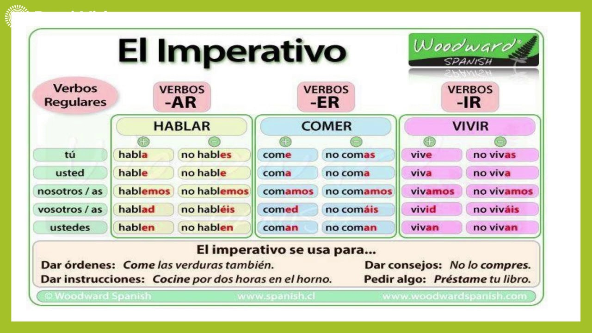

# 🇪🇸 Spanish Verb Conjugation Game Bot


<p align="center">
  
</p>


## 📚 Description

This project is an interactive game on Telegram for learning and practicing Spanish verb conjugation. Users can improve their Spanish language skills by guessing the correct verb forms in various tenses. The bot not only checks the correctness of the answers but also provides examples of the verb usage in context.

## 🤖 Demo

Check out the [Online Demo](https://t.me/esp_verbs_bot) to see the project in action!

List of commands that you can use with this Telegram bot:
- **`/start`** - Initiates the conversation with the bot and provides a welcome message.
- **`/help`** - Displays a list of available commands and their descriptions.
- **`/play`** - Starts a new game session or round.
- **`/about`** - Shows basic information about bot and databese version.

## 🚀 Features

- **FSM Support** — The bot maintains the game state for each user.
- **Example Sentences** — After each answer, an example of the verb's usage is provided.
- **Variety of Tenses** — All major Spanish tenses in a single game.

## 🛠️ Setup with Docker Compose

To quickly set up and run the project using Docker Compose, follow these steps:

### Prerequisites

Ensure you have the following installed:

- [Docker](https://www.docker.com/get-started)
- [Docker Compose](https://docs.docker.com/compose/install/)

### Steps to Setup

1. **Clone the Repository:**
  ```bash
   git clone https://github.com/dkleptsov/spanish_verbs.git
   cd spanish_verbs
  ```

2. **Set Up Environment Variables:**

  Make sure you have set your Telegram API token and Postgres credentials:

  ```bash
cat <<EOF > .env
# Bot credentials
SPANISH_VERBS_BOT="YOUR_TOKEN"
# Database parameters
DB_HOST="my_postgres"
DB_PORT="5432"
DB_NAME="spanish_verbs_db"
# Root user
POSTGRES_USER="pgdev"
POSTGRES_PASSWORD="YOUR_POSTGRES_ROOT_PASSWORD"
# Non root user
DB_USER='spanish_verbs_user'
DB_USER_PASSWORD="YOUR_POSTGRES_NONROOT_PASSWORD"
EOF
  ```

3. **Set Up the Postgres database:**

  Use Docker Compose to build and start the services defined in your docker-compose.yml file:

  ```bash
  cd sql
  docker-compose up -d --build --remove-orphans
  ```
  This command will build the images (if they don't already exist) and start the containers with the database.

4. **Launch the Bot:**

  Use Docker Compose to build and start the services defined in your docker-compose.yml file:

  ```bash
  docker-compose up -d --build --remove-orphans
  ```
  This command will build the images (if they don't already exist) and start the containers with the bot.

5. **Access your Telegram bot:**

  Check out your bot [https://t.me/YOUR_BOT_NAME](https://t.me/YOUR_BOT_NAME) to see it in action!

6. **Stop your Telegram bot:**

  To stop and remove the containers, networks, and volumes created by up:
  ```bash
  docker-compose down
  ```

## 📁 Structure of the project
```bash
spanish_verbs/
├── .github/
│   └── workflows/
│       └── pylint.yml               # github workflow Pytest
├── images
│   ├── imperativo.jpg               # Grammasr cheat sheet
│   └── spanish_verbs_bot_logo.png   # Bot logo
├── sql
│   ├── docker-compose.yml           # Docker-compose file with the Postgres 
│   ├── init_user_db.sh              # bash script to iniate db and import data 
│   ├── imperativo.csv               # CSV database 
│   ├── import_data.sql              # Script to manualy import data
│   └── list_of_verbs.txt            # List of 50 most common verbs
├── src
│   ├── bot_handlers.py              # Handlers of bot commands
│   └── bot.py                       # Bot main file
├── tests
│   └── csv_db_test.py               # Tests for csv db
├── docker-compose.yml               # Docker-compose file with the bot
├── Dockerfile                       # Dockerfile instructions
├── README.md                        # This file
└── requirements.txt                 # List of necessary Python libraries
```

## 🧑‍🏫 Grammar reference

<p align="center">
  
</p>