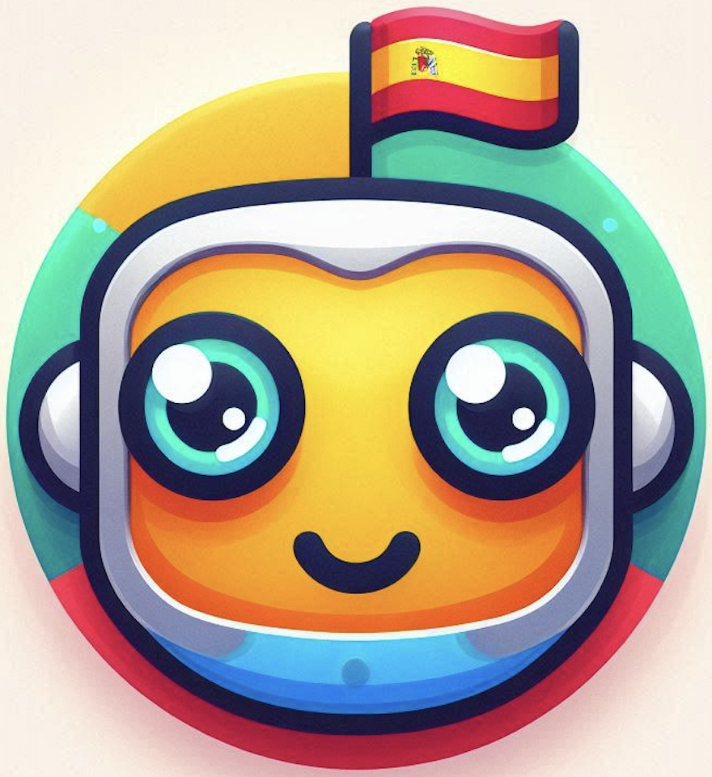

# 🇪🇸 Spanish Verb Conjugation Game Bot


<p align="center">
  
</p>


## 📚 Description

This project is an interactive game on Telegram for learning and practicing Spanish verb conjugation. Users can improve their Spanish language skills by guessing the correct verb forms in various tenses. The bot not only checks the correctness of the answers but also provides examples of the verb usage in context.

## Demo

Check out the [Online Demo](https://t.me/esp_verbs_bot) to see the project in action!

## 🚀 Features

- **FSM Support** — The bot maintains the game state for each user.
- **Example Sentences** — After each answer, an example of the verb's usage is provided.
- **Variety of Tenses** — All major Spanish tenses in a single game.
- **Continuous Play** — The bot automatically starts a new game after each response.

## 🛠️ Установка

1. Склонируйте репозиторий:

    ```bash
    git clone https://github.com/yourusername/spanish-verb-game-bot.git
    cd spanish-verb-game-bot
    ```

2. Установите зависимости:

    ```bash
    pip install -r requirements.txt
    ```

3. Создайте и настройте базу данных:

    Убедитесь, что ваша база данных `verbs.db` настроена правильно и содержит все необходимые таблицы (`verbs`, `tenses`, `subjects`, `verb_forms`, `examples`). Вы можете загрузить данные из CSV-файла или использовать свой набор данных.

4. Настройте переменные окружения:

    Убедитесь, что вы задали свой токен Telegram API:

    ```bash
    export TELEGRAM_BOT_TOKEN='YOUR_TELEGRAM_BOT_TOKEN'
    ```

5. Запустите бота:

    ```bash
    python bot.py
    ```

## 📁 Structure of the project

spanish_verbs/
├── .github/
│   └── workflows/
│       └── pylint.yml          # github workflow to linter Python code
├── data/
│   └── imperativo.csv          # CSV база данных с глаголами и примерами
│   └── list_of_verbs.txt       # Список 50 самых популярных испанских глаголов
│   └── verbs.db                # SQLite база данных с глаголами и примерами
├── bot.py                      # Основной файл бота
├── requirements.txt            # Зависимости проекта
├── README.md                   # Документация проекта
└── tests/
    └── test_bot.py             # Тесты для бота (на pytest)
